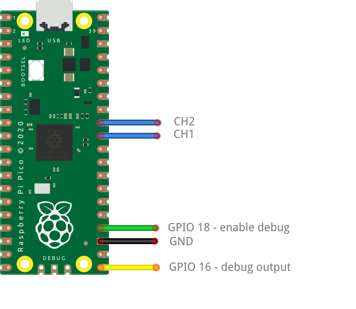
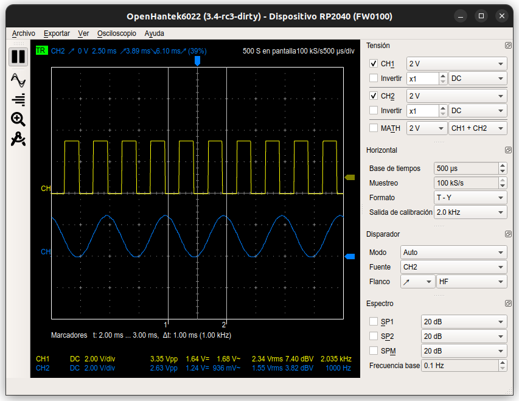
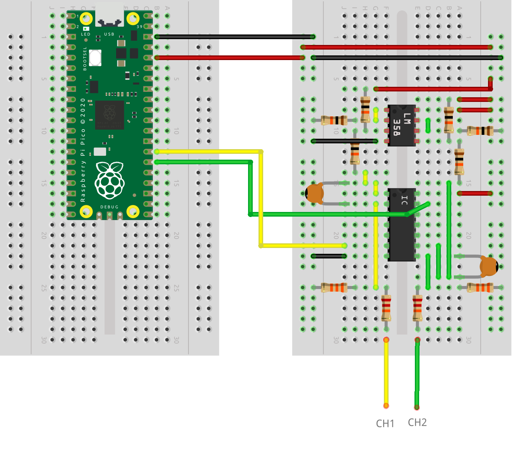

# Oscilloscope RP2040 - OpenHantek protocol

An oscilloscope for the RP2040 that implements [OpenHantek6022](https://github.com/OpenHantek/OpenHantek6022) protocol.

## Specifications

- 1 MS/s
- 2 channels

## Usage

1. Upload the binary [oscilloscope.uf2](#binaries) to RP2040.

2. Install OpenHantek. OpenHantek6022 needs to be modified for the RP2040: [OpenHantek6022 fork](https://github.com/dgatf/OpenHantek6022)

    - Build OpenHantek following the steps.  

    - Or download the binary:
        - Linux: [OpenHantek6022-RP2040.AppImage](#binaries). You may need to copy OpenHantek [udev rules](https://github.com/dgatf/OpenHantek6022/tree/main/utils).
        - Windows: [OpenHantek6022-RP2040.exe](#binaries).

    - If not using an [external circuit](#external-circuit), copy [RP2040_0_calibration.ini](RP2040_0_calibration.ini) to *~/.config/OpenHantek/ (linux)* or *%USERPROFILE%\.config\OpenHantek* (windows).

3. Launch OpenHantek6022 (modifed version). 

__Pins__

- Channel 1 -> GPIO 26
- Channel 2 -> GPIO 27
- Calibration signal -> GPIO 22
- No conversion -> GPIO 19
- Debug enable/disable -> GPIO 18
- Debug output -> GPIO 16

Without the [external circuit](#external-circuit), voltage at channels (GPIO 26 & 27) must be between 0 and 3.3V.  

Debug output is on GPIO 16 at 115200bps. To enable debug, connect to ground GPIO 18 at boot.

Led is on during the capture process.

   

   

## External circuit ##

Configure the input signal from +3.3V-0V to +5V-5V and add AC coupling.

For the gain an opamp could be added, but since we've 12bits ADC on the RP2040, will scale from 12bits value to 8bits. Maximum gain is 16. For bigger gains, use an additionnal opamp before centering the signal.

Signal conversion: 
 
 - Step down from 5V to 3.3V
 - AC/DC coupling
 - Gain (not designed)
 - Center and scale zero voltage to Vcc/2

__Materials__

 - 1 x IC switch CD4066
 - 1 x op amp LM358
 - 2 x ceramic capacitor 100nF
 - 6 x 10k resistor
 - 2 x 33k resistor
 - 2 x 22k resistor

Delete calibration file, if already copied to *config* folder.

__Pins__

- AC/DC coupling channel 1 -> GPIO 20 
- AC/DC coupling channel 2 -> GPIO 21 

   

## Calibration file Openhantek

If not using the external circuit we need to convert the signal from +3.3V-0V to +5V-5V. In order to use the full range (0-255), the conversion is done with the calibration file. Set the offsets to -127 and gains to 0.33

Copy [RP2040_0_calibration.ini](RP2040_0_calibration.ini) to *~/.config/OpenHantek/ (linux)* or *%USERPROFILE%\.config\OpenHantek* (windows).

If using the external cirucuit, set the offsets to 0 and gains to 1 or delete the calibration file.

## Binaries

- RP2040: [oscilloscope.uf2](https://drive.google.com/file/d/11BkBbbuAzuO7nqTozGVK0Epi27-wBS4m/view?usp=drive_link)
- Linux: [OpenHantek6022-RP2040.AppImage](https://drive.google.com/file/d/1I9Y5-4aRr0rqPs-FJkVPN9S7YzMd2pfn/view?usp=sharing)
- Winodws: [OpenHantek6022-RP2040.exe](https://drive.google.com/file/d/1WyPk89JrXQqL9sIHauAQx42BuTifEYTn/view?usp=sharing)

## References

- [OpenHantek6022](https://github.com/OpenHantek/OpenHantek6022)
- [libsigrok](https://github.com/sigrokproject/libsigrok)
- Das Oszi Protocol - eLinux.org
- [Usb device library](https://github.com/dgatf/usb_library_rp2040)
