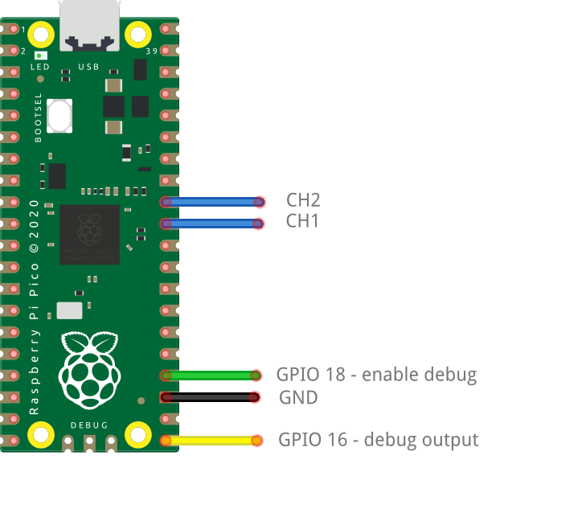
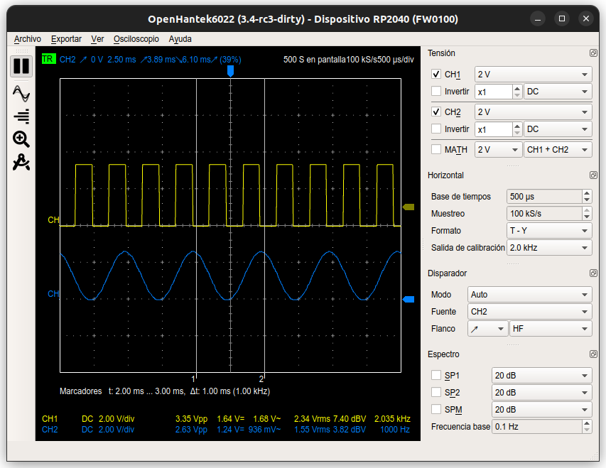
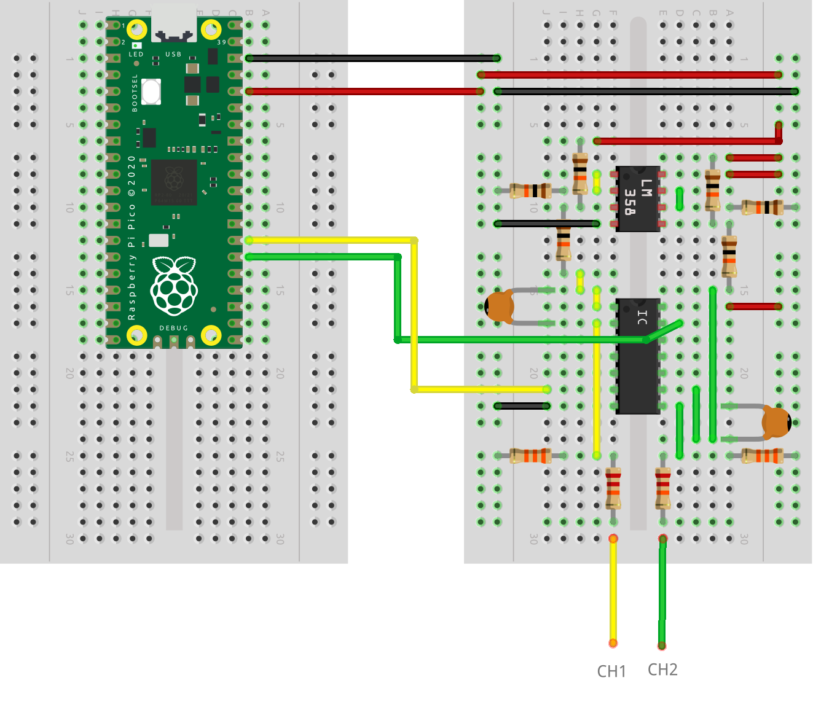

# Oscilloscope RP2040 - OpenHantek protocol

An oscilloscope for the RP2040 that implements the [OpenHantek6022](https://github.com/OpenHantek/OpenHantek6022) protocol.

## Specifications

- 1 MS/s. Reliable operation up to 500 kS/s. Higher sampling rates may drop samples due to RP2040 USB full-speed limitations
- 2 channels

## Usage

1. Upload the [oscilloscope.uf2](#binaries) firmware to the RP2040.

2. Install OpenHantek. OpenHantek6022 needs RP2040 support:
   [OpenHantek6022 fork](https://github.com/dgatf/OpenHantek6022)

   - Build OpenHantek following the project instructions.

   - Or download prebuilt [binaries](https://github.com/dgatf/OpenHantek6022/releases).

3. The external circuit is optional. If you are **not** using the [external circuit](#external-circuit), copy [RP2040_0_calibration.ini](RP2040_0_calibration.ini) to:
    - Linux: `~/.config/OpenHantek/`
    - Windows: `%USERPROFILE%\.config\OpenHantek`

4. Launch the modified version of OpenHantek6022.

__Pins__

- Channel 1 -> GPIO 26
- Channel 2 -> GPIO 27
- Calibration signal -> GPIO 22
- No conversion -> GPIO 19
- Debug enable/disable -> GPIO 18
- Debug output -> GPIO 16

Without the [external circuit](#external-circuit), voltage at the channels (GPIO 26 & 27) must be between 0 and 3.3V.

Debug output is on GPIO 16 at 57600 bps. To enable debug, connect GPIO 18 to ground at boot.

The LED is on during the capture process.

 

 

## External circuit

Configure the input signal from +3.3V-0V to +5V-5V and add AC coupling.

For the gain, an op-amp could be added, but since we have a 12-bit ADC on the RP2040, the value will be scaled from 12 bits to 8 bits. Maximum gain is 16. For higher gains, use an additional op-amp before centering the signal.

Signal conversion:

- Step down from 5V to 3.3V
- AC/DC coupling
- Gain (not designed)
- Center and scale zero voltage to Vcc/2

__Materials__

- 1 x IC switch CD4066
- 1 x op-amp LM358
- 2 x ceramic capacitor 100nF
- 6 x 10k resistor
- 2 x 33k resistor
- 2 x 22k resistor

Delete the calibration file if it was already copied to the *config* folder.

__Pins__

- AC/DC coupling channel 1 -> GPIO 20
- AC/DC coupling channel 2 -> GPIO 21

 

## Calibration file OpenHantek

If not using the external circuit, we need to convert the signal from +3.3V-0V to +5V-5V. In order to use the full range (0-255), the conversion is done with the calibration file. Set the offsets to -127 and gains to 0.33.

Copy [RP2040_0_calibration.ini](RP2040_0_calibration.ini) to *~/.config/OpenHantek/ (Linux)* or *%USERPROFILE%\.config\OpenHantek* (Windows).

If using the external circuit, set the offsets to 0 and gains to 1, or delete the calibration file.

## Remarks

RP2040 is overclocked to 240MHz. Use at your own risk.

For rates of 1 MS/s and higher, some samples are dropped. This is a limitation of the RP2040 full-speed USB.

For rates over 500 kS/s, the ADC is overclocked to 240MHz. It may be less accurate.

## Binaries

- [RP2040](https://github.com/dgatf/oscilloscope_rp2040/releases)
- [OpenHantek (RP2040)](https://github.com/dgatf/OpenHantek6022/releases)

## References

- [OpenHantek6022](https://github.com/OpenHantek/OpenHantek6022)
- [libsigrok](https://github.com/sigrokproject/libsigrok)
- Das Oszi Protocol - eLinux.org
- [Usb device library](https://github.com/dgatf/usb_library_rp2040)